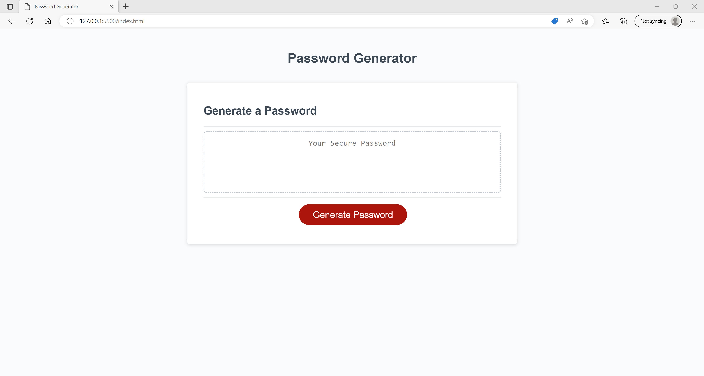
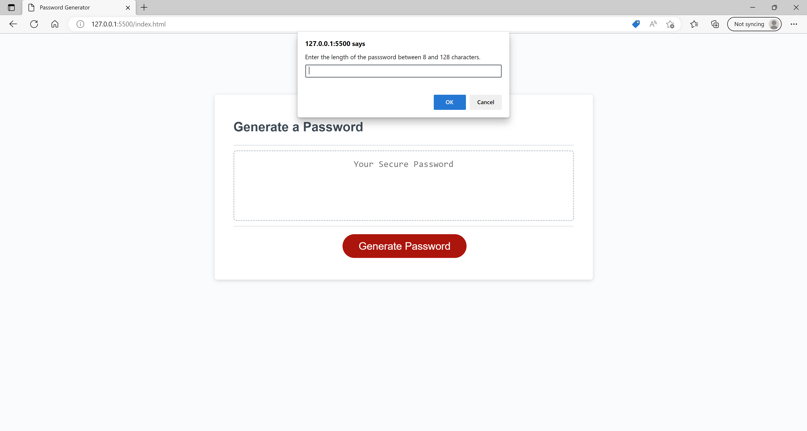
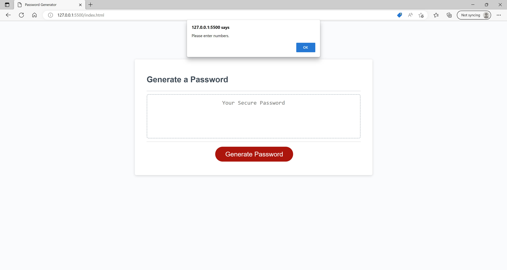
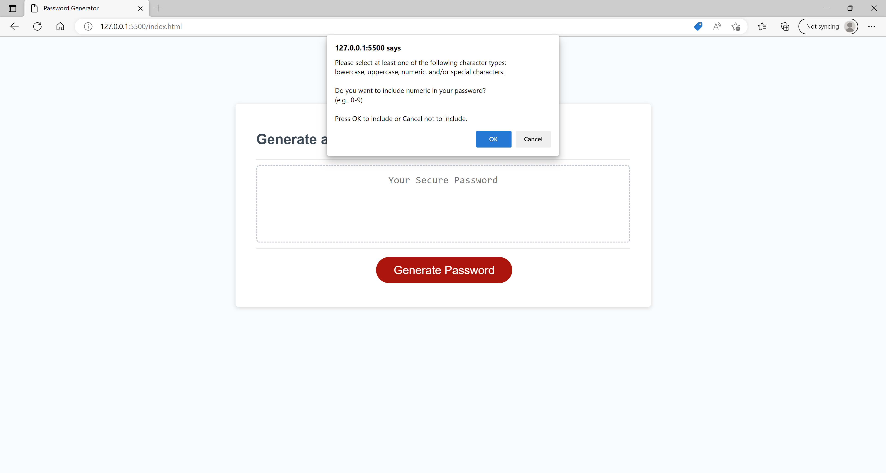
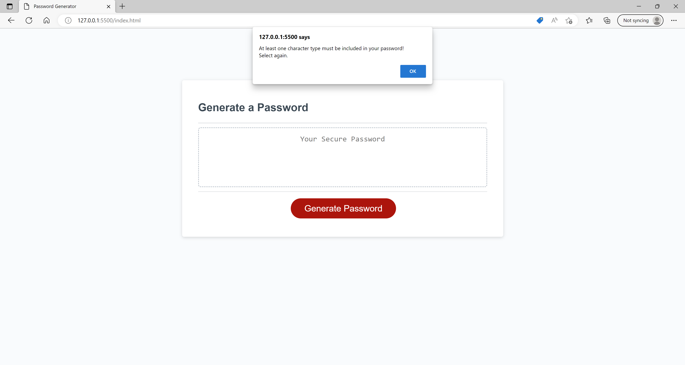
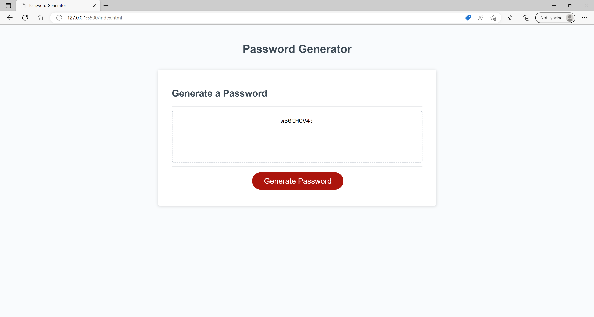

<!-- omit in toc -->
# Password Generator

<!-- omit in toc -->
## Description

This is a password generator with responsive layouts.
User will be presented with a series of prompts to choose password criteria such as the length of password or the character type to be included in the password. The input will be validated, and a random string of password that matches the selected criteria will be generated.
 
 
You can check out the deployed application from the link below:
 
[https://clairehwcho.github.io/password-generator/](https://clairehwcho.github.io/password-generator/)

<!-- omit in toc -->
## Table of Contents
- [Installation](#installation)
- [Screenshots](#screenshots)
- [License](#license)

## Installation

No special requirements.

## Screenshots

- Index page

- Prompt for the length of password

- Validation for the input of length

- Prompt for the character type to be included in the password

- Validation for the character type selection

- Password generated

## License
Copyright © 2022 [Claire Cho](https://github.com/clairehwcho).